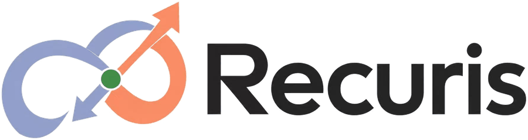
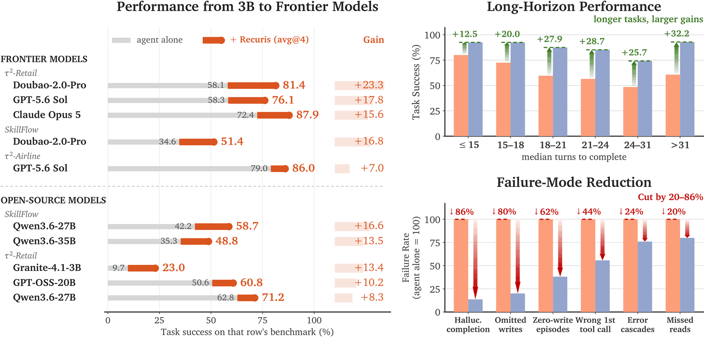
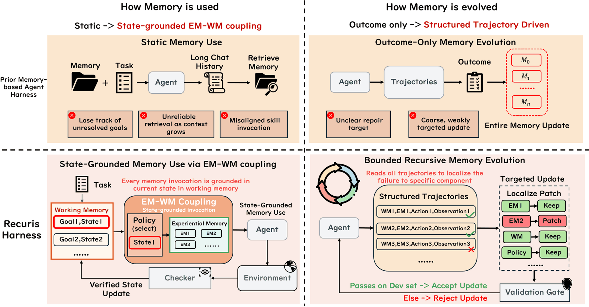

<a name="readme-top"></a>

<p align="center">
  <picture>
    <source media="(prefers-color-scheme: dark)" srcset="assets/recuris-logo-dark.png">
    
  </picture>
</p>

<h3 align="center">
Recursive Experiential–Working Memory Evolution for Long-Horizon Agent Harnesses
</h3>

<p align="center">
  <a href="https://arxiv.org/abs/2608.24876"></a>
  <a href="https://huggingface.co/papers/2608.24876"></a>
  <a href="https://x.com/lingyang_pu/status/2092432103954841925"></a>
</p>

<p align="center">
  <b>National University of Singapore</b> &nbsp;·&nbsp; <b>Stanford University</b> &nbsp;·&nbsp; <b>University of Oxford</b> &nbsp;·&nbsp; <b>Princeton University</b>
</p>

---

<p align="center">
  
</p>

## 💡 Introduction

**Recuris** is a recursive self-improvement framework that **improves a
long-horizon agent by evolving its memory instead of its weights or its
prompt**. A frozen agent is paired with a **Skill Memory** `M = (E, W, ρ, C)`.
A meta-agent reads structured execution traces, locates each failure in one
component of that memory, and patches only that component. A deterministic
validation gate then decides, on paired held-out evidence, whether the patch
survives. Recuris has the following key features:

- **State-grounded memory use.** Working memory drives skill invocation, so
  retrieval is conditioned on verified task state rather than on a chat history
  that grows until the state is buried.
- **Targeted memory evolution.** Structured trajectories `(w_t, E_t, a_t, o_t)`
  locate a failure in a specific component, instead of nudging a monolithic
  prompt from outcomes alone.
- **Bounded by a validation gate.** Candidates are admitted by paired held-out
  arithmetic and nothing else. No model votes on its own patch.
- **Training-free and model-agnostic.** The downstream agent stays frozen, and a
  memory evolved on one model transfers to others unchanged.

Overall, Recuris achieves **higher task success**, **larger gains on longer
horizons**, and **substantially fewer long-horizon failures**, on both frontier
and open-source agents.

<p align="center">
  
</p>

## 🔔 News

- **[2026-08]** 🎉 Initial release: evaluation and evolution code, the evolved
  Skill Memory packages, and the frozen evaluation splits.

## 📊 Results

Task success (`avg@4`, %), each model run with the benchmark's own reference
agent alone and with that same agent plus Recuris. **Bold** marks the better of
each pair, the subscript is Δ, † marks a paired task-clustered bootstrap 95% CI
excluding zero, and `n/a` means the model was not run on that benchmark.

<table>
<thead>
<tr>
  <th align="left" rowspan="2">Model</th>
  <th align="center" colspan="3"><i>Cross-task evolution</i></th>
  <th align="center"><i>Within-task adaptation</i></th>
</tr>
<tr>
  <th align="right">τ²-Retail</th>
  <th align="right">τ²-Airline</th>
  <th align="right">SkillFlow</th>
  <th align="right">Terminal-Bench 2.1</th>
</tr>
</thead>
<tbody>
<tr><td colspan="5"><i>Open-source models</i></td></tr>

<tr><td align="left">Granite-4.1-3B</td>
  <td align="right">9.7</td><td align="right">34.3</td>
  <td align="right"><b>0.3</b></td><td align="right">0.6</td></tr>
<tr><td align="left">&nbsp;&nbsp;<b>+ Recuris</b></td>
  <td align="right"><b>23.0</b> <sub>+13.4†</sub></td>
  <td align="right"><b>39.8</b> <sub>+5.5</sub></td>
  <td align="right">0.0 <sub>−0.3</sub></td>
  <td align="right"><b>3.1</b> <sub>+2.5</sub></td></tr>

<tr><td align="left">Qwen3.5-4B</td>
  <td align="right">68.0</td><td align="right">75.3</td>
  <td align="right">6.0</td><td align="right">10.1</td></tr>
<tr><td align="left">&nbsp;&nbsp;<b>+ Recuris</b></td>
  <td align="right"><b>68.3</b> <sub>+0.3</sub></td>
  <td align="right"><b>79.0</b> <sub>+3.8</sub></td>
  <td align="right"><b>7.1</b> <sub>+1.1</sub></td>
  <td align="right"><b>13.0</b> <sub>+2.9</sub></td></tr>

<tr><td align="left">Qwen3.5-9B</td>
  <td align="right">77.6</td><td align="right">75.5</td>
  <td align="right">15.1</td><td align="right">17.4</td></tr>
<tr><td align="left">&nbsp;&nbsp;<b>+ Recuris</b></td>
  <td align="right"><b>79.6</b> <sub>+2.0</sub></td>
  <td align="right"><b>78.4</b> <sub>+2.9</sub></td>
  <td align="right"><b>18.4</b> <sub>+3.4</sub></td>
  <td align="right"><b>20.5</b> <sub>+3.1</sub></td></tr>

<tr><td align="left">GPT-OSS-20B</td>
  <td align="right">50.6</td><td align="right">54.8</td>
  <td align="right">7.8</td><td align="right">3.9</td></tr>
<tr><td align="left">&nbsp;&nbsp;<b>+ Recuris</b></td>
  <td align="right"><b>60.8</b> <sub>+10.2†</sub></td>
  <td align="right"><b>59.3</b> <sub>+4.5†</sub></td>
  <td align="right"><b>10.4</b> <sub>+2.6†</sub></td>
  <td align="right"><b>6.7</b> <sub>+2.8</sub></td></tr>

<tr><td align="left">Qwen3.6-27B</td>
  <td align="right">62.8</td><td align="right">79.0</td>
  <td align="right">42.2</td><td align="right">38.8</td></tr>
<tr><td align="left">&nbsp;&nbsp;<b>+ Recuris</b></td>
  <td align="right"><b>71.2</b> <sub>+8.3†</sub></td>
  <td align="right"><b>80.0</b> <sub>+1.0</sub></td>
  <td align="right"><b>58.7</b> <sub>+16.6†</sub></td>
  <td align="right"><b>42.1</b> <sub>+3.3</sub></td></tr>

<tr><td align="left">Qwen3.6-35B</td>
  <td align="right">78.2</td><td align="right">80.3</td>
  <td align="right">35.3</td><td align="right">33.1</td></tr>
<tr><td align="left">&nbsp;&nbsp;<b>+ Recuris</b></td>
  <td align="right"><b>78.5</b> <sub>+0.3</sub></td>
  <td align="right"><b>81.5</b> <sub>+1.3</sub></td>
  <td align="right"><b>48.8</b> <sub>+13.5†</sub></td>
  <td align="right"><b>36.4</b> <sub>+3.3</sub></td></tr>

<tr><td colspan="5"><i>Frontier models</i></td></tr>

<tr><td align="left">Gemini 3.7 Flash</td>
  <td align="right">73.5</td><td align="right"><b>86.5</b></td>
  <td align="right">n/a</td><td align="right">79.8</td></tr>
<tr><td align="left">&nbsp;&nbsp;<b>+ Recuris</b></td>
  <td align="right"><b>78.3</b> <sub>+4.8</sub></td>
  <td align="right">85.0 <sub>−1.5</sub></td>
  <td align="right">n/a</td>
  <td align="right"><b>82.4</b> <sub>+2.6</sub></td></tr>

<tr><td align="left">GPT-5.6 Sol</td>
  <td align="right">58.3</td><td align="right">79.0</td>
  <td align="right">n/a</td><td align="right">83.2</td></tr>
<tr><td align="left">&nbsp;&nbsp;<b>+ Recuris</b></td>
  <td align="right"><b>76.1</b> <sub>+17.8†</sub></td>
  <td align="right"><b>86.0</b> <sub>+7.0†</sub></td>
  <td align="right">n/a</td>
  <td align="right"><b>86.4</b> <sub>+3.2</sub></td></tr>

<tr><td align="left">Claude Opus 5</td>
  <td align="right">72.4</td><td align="right">89.5</td>
  <td align="right">n/a</td><td align="right">84.6</td></tr>
<tr><td align="left">&nbsp;&nbsp;<b>+ Recuris</b></td>
  <td align="right"><b>87.9</b> <sub>+15.6†</sub></td>
  <td align="right"><b>90.5</b> <sub>+1.0</sub></td>
  <td align="right">n/a</td>
  <td align="right"><b>88.4</b> <sub>+3.8</sub></td></tr>

<tr><td align="left">Doubao-2.0-Pro <i>(deployment)</i></td>
  <td align="right">58.1</td><td align="right">75.5</td>
  <td align="right">34.6</td><td align="right">46.1</td></tr>
<tr><td align="left">&nbsp;&nbsp;<b>+ Recuris</b></td>
  <td align="right"><b>81.4</b> <sub>+23.3†</sub></td>
  <td align="right"><b>80.5</b> <sub>+5.0</sub></td>
  <td align="right"><b>51.4</b> <sub>+16.8†</sub></td>
  <td align="right"><b>48.9</b> <sub>+2.9</sub></td></tr>
</tbody>
</table>

Recuris improves task success in **35 of the 37** completed model and benchmark
pairs, from a 3B open-source agent up to the strongest frontier models. The
largest gains reach **+23.3** on τ²-Retail and **+16.8** on SkillFlow. Gains
grow with the interaction horizon, reaching **+32.2** on the longest tasks, and
common long-horizon failure modes drop by up to **80%**.

## 🛠️ Getting Started

This repository provides the code for running Recuris on τ²-Bench, SkillFlow and
Terminal-Bench 2.1, the Skill Memory packages produced by the evolution loop,
and the frozen evaluation splits.

### 📦 Install Packages

Python 3.12 and `git`. SkillFlow and Terminal-Bench 2.1 also need Docker
with the Compose V2 plugin (`docker compose version` must work; harbor
shells out to it for every task).

```bash
git clone https://github.com/Gen-Verse/Recuris.git recuris
cd recuris

uv sync --extra all          # or: pip install -e ".[all]"
```

### ⚙️ Setup Environment Variables

Put your endpoint in a `.env` file at the repository root, or export it:

```bash
OPENAI_API_KEY=...
OPENAI_BASE_URL=...
```

Any OpenAI-compatible endpoint works. This is needed even when the agent itself
is an open-source model, because τ²-Bench scores every episode with an LLM user
simulator and an LLM assertion judge, and both stay pinned to a reference model.

## 🚀 Quick Start

Each benchmark is run twice, once with a Skill Memory loaded and once without.
The two runs differ only in the flags shown below. Both are needed, because the
number that matters is the difference between them.

### 🔹 **τ²-Bench (retail and airline)**

Set up the benchmark:

```bash
bash third_party/tau2/setup.sh
uv pip install -e external/tau2-bench
recuris check-data --benchmark tau2
```

Install tau2 after `uv sync`, not before: `uv sync` resolves the environment to
exactly what `pyproject.toml` declares, so running it again removes anything
added with `uv pip install`.

Serve an open-source model locally. τ²-Bench drives the agent through tool
calls, so the two tool-calling flags are required, not optional: without them
vLLM rejects every request and every episode ends ungraded.

```bash
vllm serve <model-id> --port 8000 --served-model-name qwen3.6-27b \
    --enable-auto-tool-choice --tool-call-parser hermes
```

`hermes` is the parser for Qwen; other families need their own (see vLLM's
tool-calling docs). A frontier model served by a provider needs none of this.

Now point the agent at it:

```bash
export TAU2_GATE_TERM=1 TAU2_GATE_TERM_WM=1 TAU2_STATUS_BOARD=1

# open-source example
export MODEL=openai/qwen3.6-27b
export ARGS='{"api_base":"http://127.0.0.1:8000/v1","api_key":"dummy","temperature":0.0,"timeout":360,"num_retries":2}'

# frontier example
# export MODEL=openai/<provider-model>
# export ARGS='{"api_base":"'"$OPENAI_BASE_URL"'","api_key":"'"$OPENAI_API_KEY"'","temperature":0.0,"timeout":360,"num_retries":2,"reasoning_effort":"high","allowed_openai_params":["reasoning_effort"]}'
```

Run both configurations and compare them:

```bash
# with Skill Memory
recuris tau2 --domain retail --agent recuris_agent --skill-memory tau2_retail \
    --open-downstream --agent-llm "$MODEL" --agent-llm-args "$ARGS" \
    --num-trials 4 --max-concurrency 4 --save-to retail_skill

# without
recuris tau2 --domain retail --agent llm_agent \
    --open-downstream --agent-llm "$MODEL" --agent-llm-args "$ARGS" \
    --num-trials 4 --max-concurrency 4 --save-to retail_bare

recuris compare --a retail_skill --b retail_bare
```

#### Notes:

* **`--domain`** is `retail` or `airline`. For airline, use
  `--skill-memory tau2_airline`.
* **`--agent-llm-args`** must be identical in both runs. It is validated rather
  than merged, so an unknown key raises an error instead of being dropped
  silently.
* Switching models means changing `$MODEL` and `$ARGS`. Nothing else changes.
  Some servers need extras, for example
  `"extra_body":{"chat_template_kwargs":{"enable_thinking":false}}` for Qwen.

### 🔹 **SkillFlow**

Set up the benchmark and build the task images once:

```bash
pip install huggingface_hub
bash third_party/skillflow/setup.sh

./external/SkillFlow/docker/harbor-cli-base/build.sh
python external/SkillFlow/utils/prebuild_task_images.py \
    --tasks-root external/SkillFlow/test_tasks
```

Generate the configs for both runs, then execute them:

```bash
export MODEL=openai/qwen3.6-27b
export BASE=http://127.0.0.1:8000/v1

recuris skillflow render-configs --arm bare \
    --model "$MODEL" --base-url "$BASE" --out configs/skillflow/generated
recuris skillflow render-configs --arm skill --routing default \
    --model "$MODEL" --base-url "$BASE" \
    --skill-memory skillflow --out configs/skillflow/generated

for cfg in configs/skillflow/generated/bare_*.yaml;  do harbor run -c "$cfg" --yes; done
for cfg in configs/skillflow/generated/skill_*.yaml; do harbor run -c "$cfg" --yes; done

recuris skillflow score --bare jobs/bare --skill jobs/skill
```

#### Notes:

* Run the jobs **one at a time**. Concurrent harbor jobs exhaust the Docker IPv4
  address pool, and the resulting failure looks like something else entirely.
* Configs are generated rather than committed, so the two runs cannot drift
  apart and no credential is ever written to disk.
* **`--routing default`** is model-agnostic and is the right choice for new
  work. `--routing frozen_insample` reproduces our reported numbers and applies
  six per-family overrides that were chosen in-sample.

### 🔹 **Terminal-Bench 2.1 (test-time adaptation)**

```bash
bash third_party/tb21/setup.sh
recuris check-data --benchmark tb21
```

On this benchmark a task may be attempted several times in a row, and it stops
as soon as one attempt succeeds. `--rounds` sets how many attempts each task
gets. There are three configurations:

| Configuration | What the agent carries | After a failed attempt |
|---|---|---|
| `bare` | nothing, the stock agent | nothing changes, the next attempt starts over |
| `m0` | a fixed Skill Memory, the seed package | nothing changes, the next attempt gets the same package |
| `tta` | the same package, as a per-task copy | the meta-agent reads the failed trajectory and writes a new card into that copy, which the next attempt carries |

```bash
# smoke test: one task, one attempt
recuris tta run --taskset splits/tb21/tta_taskset_v3.json \
    --run-id smoke --arm m0 --limit 1 --rounds 1

# all three configurations, four attempts each
for cfg in bare m0 tta; do
    recuris tta run --taskset splits/tb21/tta_taskset_v3.json \
        --run-id demo --arm "$cfg" --rounds 4 --concurrency 3
done
```

#### Notes:

* Give all three configurations the same `--rounds`. Comparing `tta` at four
  attempts against `bare` at one mostly measures the extra attempts rather than
  adaptation.
* `m0` against `bare` isolates the value of having a Skill Memory at all. `tta`
  against `m0` isolates the value of updating it between attempts, since both
  carry a package and both get the same number of attempts.
* At four attempts, that second comparison is worth **+2.3** points, 60.9%
  against 58.6%, which is not significant at this sample size. We report it
  that way rather than as a headline number.

### 🔹 **Evolving a Skill Memory**

This is the recursive loop. A meta-agent, the **upstream** model, reads failed
trajectories from the agent being improved, the **downstream** model. It patches
one component of the memory, and a gate admits the patch only on paired held-out
evidence.

To run the upstream phases through a local tool-calling model with DeepSeek
Harness, including searchable phase history, persistent working memory,
read-only context workers, and parent/child telemetry, see
[Running local DSH agents](docs/local-dsh-agents.md).

```bash
npm install -g @anthropic-ai/claude-code
```

```bash
RECURIS_META_MODEL=...        # the upstream meta-agent's model
RECURIS_META_BASE_URL=...
RECURIS_META_API_KEY=...
```

```bash
# one scoped session, zero simulations: checks the plumbing first
recuris metaagent qualify --run-id qsmoke --proxy-port 4047

recuris metaagent run --domain retail --run-id retail_v1 \
    --splits splits/tau2/retail_from0_v1_k4.json \
    --rounds 4 --k 4 --arm autonomous --base neutral \
    --round-gate progressive --power-gate warn --reg-cap 1 \
    --meta-workflow hierarchical --diagnosis-workers 3 \
    --max-concurrency 6 --max-sims 1400 --proxy-port 4047
```

To evolve a memory **for an open-source downstream model**, unfreeze the worker
only. The user simulator stays pinned, so rounds remain comparable:

```bash
recuris metaagent run --domain retail --run-id retail_gptoss_v1 \
    --splits splits/tau2/retail_from0_v1_k4.json \
    --rounds 4 --k 4 --arm autonomous --base neutral \
    --open-worker --worker-model openai/gpt-oss-20b \
    --worker-llm-args '{"api_base":"http://127.0.0.1:8000/v1","api_key":"dummy","temperature":0.0,"timeout":360,"num_retries":2,"stop_token_ids":[200002,200012]}' \
    --round-gate progressive --power-gate warn --reg-cap 1 \
    --meta-workflow hierarchical --max-concurrency 6 --proxy-port 4047
```

#### Notes:

* **`--meta-model`** is the upstream meta-agent and **`--worker-model`** is the
  downstream agent being improved. Both default to Doubao.
* **`--base neutral`** starts from a deterministic seed package, so no
  hand-written domain profile enters the loop.
* Start with `qualify` and then a single round. Each round writes a full record:
  the evidence the session was given, the plan it produced, the gate arithmetic,
  and the ledger entry. A round that admits nothing is a valid outcome.
* Evolving a package for a specific model beats reusing one evolved elsewhere.
  On GPT-OSS-20B a rebuilt package gained **+10.2**, while the general-purpose
  package transferred negatively.

## 📖 Citation

```bibtex
@article{yu2026recuris,
  title   = {Recursive Experiential--Working Memory Evolution for Long-Horizon Agent Harnesses},
  author  = {Yu, Zhaochen and Wu, Yingcheng and Yin, Zhenfei and Chen, Kaiyuan and Zhao, Zhe and Wang, Mengdi and Yan, Shuicheng and Yang, Ling},
  journal = {arXiv preprint arXiv:2608.24876},
  year    = {2026}
}
```

<p align="right">(<a href="#readme-top">back to top</a>)</p>
