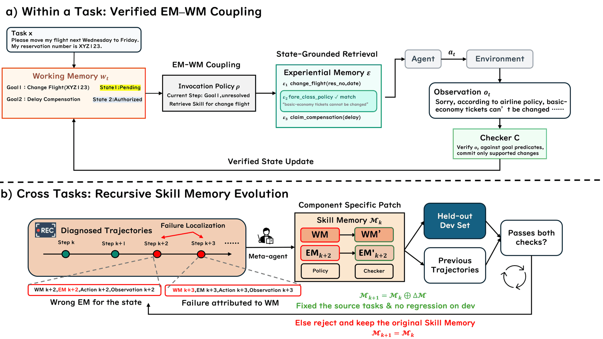
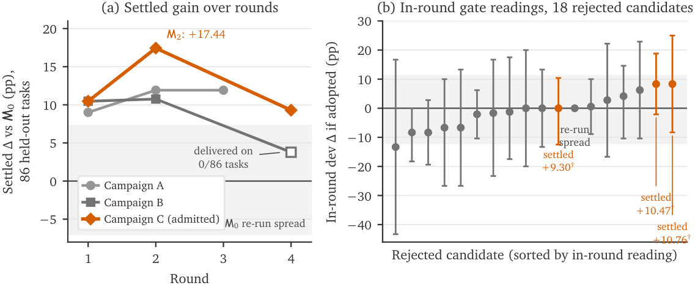

<a name="readme-top"></a>

<p align="center">
  
</p>

<h3 align="center">
Recursive Experiential–Working Memory Evolution for Long-Horizon Agent Harnesses
</h3>

<p align="center">
  
  
  
  
  <br><br>
  <a href="#-citation"></a>
  <a href="https://github.com/Gen-Verse/Recuris"></a>
  <a href="#-running-experiments"></a>
  <a href="https://www.python.org/"></a>
  <a href="LICENSE"></a>
</p>

<p align="center">
  <b>National University of Singapore</b> &nbsp;·&nbsp; <b>Stanford University</b> &nbsp;·&nbsp; <b>University of Oxford</b> &nbsp;·&nbsp; <b>Princeton University</b>
</p>

---

<p align="center">
  
</p>

## 💡 Introduction

**Recuris** is a recursive self-improvement framework that **improves a
long-horizon agent by evolving its memory rather than its weights or its
prompt**. A frozen agent is paired with a **Skill Memory** `M = (E, W, ρ, C)`;
a meta-agent reads structured execution traces, localises each failure to one
component of that memory, and patches only that component — and a deterministic
validation gate decides on paired held-out evidence whether the patch survives.
Recuris has the following key features:

- **State-grounded memory use** — working memory drives skill invocation, so
  retrieval is conditioned on verified task state instead of a chat history that
  grows until the state is buried.
- **Targeted memory evolution** — structured trajectories `(w_t, E_t, a_t, o_t)`
  attribute a failure to a specific component, instead of nudging a monolithic
  prompt from outcomes alone.
- **Bounded by a validation gate** — candidates are admitted by paired held-out
  arithmetic and nothing else. No model votes on its own patch, so a round that
  accepts nothing is a valid outcome.
- **Training-free and model-agnostic** — the downstream agent stays frozen, and
  a memory evolved on one model transfers to others unchanged.

Overall, Recuris delivers **higher task success**, **larger gains as the horizon
grows**, and **substantially fewer long-horizon failures**, across both frontier
and open-weight agents.

<p align="center">
  
</p>

> Across four long-horizon benchmarks and ten models, Recuris improves task
> success in **35 of 37** completed model–benchmark pairs, adding **+17.8** to
> GPT-5.6 Sol and **+15.6** to Claude Opus 5 on τ²-Bench — taking Opus 5 to
> **87.9%**. The advantage *widens* with the interaction horizon, reaching
> **+32.2** points on the longest tasks, and common long-horizon failure modes
> fall by up to **80%**.

## 🔔 News

- **[2026-08]** 🎉 Initial release: evaluation and evolution code, the evolved
  Skill Memory packages, and the frozen evaluation splits.

## 📊 Results

Every number is a **paired** contrast: the same tasks, the same trials, the same
model, differing only in whether the Skill Memory is loaded. Intervals are
task-clustered bootstrap over 10,000 resamples, and every row is `avg@4` over
all tasks in the domain with **zero ungraded cells**.

| Benchmark | Model | Agent alone | + Recuris | Δ | 95% CI |
|---|---|---:|---:|---:|---|
| τ²-Retail | GPT-5.6 Sol | 58.33 | **76.10** | **+17.76** | [+11.84, +23.90] |
| τ²-Retail | Claude Opus 5 | 72.37 | **87.94** | **+15.57** | [+10.96, +20.18] |
| τ²-Retail | Gemini-3.7 Flash | 73.46 | 78.29 | +4.82 | [−0.22, +10.09] |
| τ²-Airline | GPT-5.6 Sol | 79.00 | **86.00** | **+7.00** | [+1.50, +13.00] |
| τ²-Airline | Claude Opus 5 | 89.50 | 90.50 | +1.00 | [−3.00, +4.00] |
| τ²-Airline | Gemini-3.7 Flash | 86.50 | 85.00 | −1.50 | [−5.50, +2.00] |
| SkillFlow | Doubao-2.0-Pro | 34.6 | **51.4** | **+16.8** | [+11.0, +22.8] |

<sub>Bold marks an interval that excludes zero. The package was evolved on a
mid-capability model and transferred to these three <b>unchanged</b>; none of
them participated in evolution. The figure at the top of this page carries the
full set, from Granite-4.1-3B up to the frontier.</sub>

The pattern worth noticing is that the gain tracks how much **treatable failure**
the model still has in that domain, not how strong the model is. The same Claude
Opus 5 buys +15.57 on retail, where it starts at 72.4, and +1.00 on airline,
where it already starts at 89.5. Same model, same package, two domains — no
capability difference to explain it away.

> ⚠️ **Absolute τ² scores here are not comparable to the public τ²-Bench
> leaderboard**, which uses a different judge model. Cross-arm comparisons *are*
> valid, because both arms of every comparison are judged by exactly the same
> model. See [Scope and Limitations](#-scope-and-limitations).

Terminal-Bench 2.1 test-time adaptation is reported separately and more
cautiously: at a **matched attempt budget**, learning between attempts is worth
**+2.3** points over pure retry (60.9% vs 58.6%, N=4, not significant). Most of
the headline gain over a single attempt comes from the extra attempts, not from
the learning — so we report it that way.

## 🧠 How It Works

<p align="center">
  
</p>

**Within a task.** Working Memory holds each goal and its verified state. The
invocation policy `ρ` picks the unresolved goal, retrieves the Experiential
Memory card for it, and the agent acts. A checker `C` verifies the observation
against the goal's predicates, and **only a verified observation may update
state** — the model cannot write its own progress.

**Across tasks.** Each episode leaves a structured trajectory. A fixed
meta-agent reads those, attributes the failure to one component, and emits a
patch touching only that component. The candidate is admitted only if a paired
held-out gate says so; otherwise the memory is left exactly as it was.

<p align="center">
  
</p>

The gate is the load-bearing part, and **a round that accepts nothing is a
result**. Several rejected candidates read *positive* in-round — the gap between
an in-round reading and a settled one is exactly the overfitting the gate exists
to catch.

## 🛠️ Getting Started

Python 3.11 or 3.12, `git`, and — for SkillFlow and Terminal-Bench 2.1 — Docker.

### 📦 Install

```bash
git clone https://github.com/Gen-Verse/Recuris.git recuris
cd recuris
uv sync --extra all          # or: pip install -e ".[all]"
```

### ⚙️ Set Up Environment Variables

Two variables are needed by every benchmark. Put them in a `.env` at the
repository root, or export them:

```bash
OPENAI_API_KEY=...
OPENAI_BASE_URL=...
```

Any OpenAI-compatible endpoint. **This is required even for open-weight arms**,
and the reason is not incidental: τ²-Bench scores every episode with an LLM user
simulator and an LLM assertion judge, both pinned to a reference model. That
pinning is part of the evaluation protocol, not an implementation choice, so an
arm whose downstream agent is a local model still calls out for the simulator
and the judge.

Nothing here has a vendor default. Every path fails closed with the name of the
variable to set, because an endpoint nobody chose deliberately is worse than an
error.

<details>
<summary>Optional variables, introduced where they are needed</summary>

<br/>

| Variable | For |
|---|---|
| `RECURIS_META_MODEL` / `RECURIS_META_BASE_URL` / `RECURIS_META_API_KEY` | the meta-agent (D2) |
| `RECURIS_SESSION_LAUNCHER` | substituting your own coding agent (D2) |
| `RECURIS_WORKSPACE`, `RECURIS_EXTERNAL_ROOT`, `TAU2_ROOT`, `TAU2_DATA_DIR`, `RECURIS_SKILLFLOW_TASKS`, `RECURIS_TB21_TASKS` | relocating directories |
| `TAU2_GATE_TERM`, `TAU2_GATE_TERM_WM`, `TAU2_STATUS_BOARD` | declaring the τ² treatment |

</details>

## 🚀 Quick Start

There are two things to do with this repository, and they are different jobs:

| | |
|---|---|
| **[Part 1 — Inference](#part1)** | take a Skill Memory we already evolved, load it into a frozen agent, and measure what it buys |
| **[Part 2 — Recursive Self-Improvement](#part2)** | evolve a *new* Skill Memory for your own model, one gated round at a time |

Every example below is a **pair**: a skill arm and a bare control that differ in
the flags shown and in nothing else. Run both, or the number means nothing.
[Running Experiments](#-running-experiments) has the full flag reference, the
costs, and the caveats.

---

<a name="part1"></a>

### Part 1 — Inference with a provided Skill Memory

<br/>

#### 1a. Open-weight on τ²-Bench — Qwen3.6-27B

Serve the model on any OpenAI-compatible endpoint, then unfreeze **only** the
downstream agent — the user simulator and the assertion judge stay pinned, which
is what keeps the comparison single-variable:

```bash
bash third_party/tau2/setup.sh && uv pip install -e external/tau2-bench

vllm serve Qwen/Qwen3.6-27B --port 8000 --served-model-name qwen3.6-27b
```

```bash
export TAU2_GATE_TERM=1 TAU2_GATE_TERM_WM=1 TAU2_STATUS_BOARD=1

export SERVED=openai/qwen3.6-27b
export ARGS='{"api_base":"http://127.0.0.1:8000/v1","api_key":"dummy","temperature":0.0,"timeout":360,"num_retries":2,"extra_body":{"chat_template_kwargs":{"enable_thinking":false}}}'

# skill arm
recuris tau2 --domain retail --agent recuris_agent --skill-memory tau2_retail \
    --open-downstream --agent-llm "$SERVED" --agent-llm-args "$ARGS" \
    --num-trials 4 --max-concurrency 4 --save-to retail_qwen27b_skill

# bare control — same endpoint, same decoding, no memory
recuris tau2 --domain retail --agent llm_agent \
    --open-downstream --agent-llm "$SERVED" --agent-llm-args "$ARGS" \
    --num-trials 4 --max-concurrency 4 --save-to retail_qwen27b_bare

recuris compare --a retail_qwen27b_skill --b retail_qwen27b_bare
```

Airline is the same with `--domain airline --skill-memory tau2_airline`.

`--agent-llm-args` must be **byte-identical between the two arms**. It is
validated rather than merged, so a misspelled key is an error instead of a
silent drop — setting it once in a shell variable is the reliable way. The
`enable_thinking: false` in `extra_body` is Qwen-specific; drop it for a server
that does not take it.

#### 1b. A small open-weight model — Qwen3.6-4B

Identical, with a different served model:

```bash
vllm serve Qwen/Qwen3.6-4B --port 8000 --served-model-name qwen3.6-4b

export SERVED=openai/qwen3.6-4b
# ... same $ARGS, same two commands, --save-to retail_qwen4b_{skill,bare}
```

Worth calibrating expectations at this size. In our measurements a ~3–4B agent
still gains on τ²-Retail — Granite-4.1-3B goes 9.7 → 23.0 (**+13.4**) — but on
SkillFlow the same class of model scores near zero in **both** arms, which is a
capability wall, not a memory effect. A Skill Memory can only recover failures
the model is otherwise capable of avoiding. Always read the bare arm first: if
it is at the floor, the pair has nothing to say.

#### 1c. Open-weight on SkillFlow — Qwen3.6-27B

```bash
uv sync --extra skillflow && pip install huggingface_hub
bash third_party/skillflow/setup.sh
./external/SkillFlow/docker/harbor-cli-base/build.sh
python external/SkillFlow/utils/prebuild_task_images.py \
    --tasks-root external/SkillFlow/test_tasks
```

```bash
export SERVED=openai/qwen3.6-27b
export SERVED_BASE=http://127.0.0.1:8000/v1

recuris skillflow render-configs --arm bare \
    --model "$SERVED" --base-url "$SERVED_BASE" \
    --out configs/skillflow/generated

recuris skillflow render-configs --arm skill --routing default \
    --model "$SERVED" --base-url "$SERVED_BASE" \
    --skill-memory skillflow --out configs/skillflow/generated

# one job at a time -- concurrent harbor jobs exhaust the Docker IPv4 pool
for cfg in configs/skillflow/generated/bare_*.yaml;  do harbor run -c "$cfg" --yes; done
for cfg in configs/skillflow/generated/skill_*.yaml; do harbor run -c "$cfg" --yes; done

recuris skillflow score --bare jobs/bare --skill jobs/skill
```

Use `--routing default` for any model. `--routing frozen_insample` additionally
applies six per-family overrides that were chosen by reading those families' own
scores; it reproduces our reported arm, and it is in-sample.

#### 1d. Frontier models on τ²-Bench — GPT / Claude

Same shape, pointed at a provider endpoint. Frontier arms in the paper ran with
the three treatment switches **off**:

```bash
unset TAU2_GATE_TERM TAU2_GATE_TERM_WM TAU2_STATUS_BOARD

export ARGS='{"api_base":"'"$OPENAI_BASE_URL"'","api_key":"'"$OPENAI_API_KEY"'","temperature":0.0,"timeout":360,"num_retries":2,"reasoning_effort":"high","allowed_openai_params":["reasoning_effort"]}'

export MODEL=openai/<provider-model>

recuris tau2 --domain retail --agent recuris_agent --skill-memory tau2_retail \
    --open-downstream --agent-llm "$MODEL" --agent-llm-args "$ARGS" \
    --num-trials 4 --max-concurrency 4 --save-to retail_frontier_skill

recuris tau2 --domain retail --agent llm_agent \
    --open-downstream --agent-llm "$MODEL" --agent-llm-args "$ARGS" \
    --num-trials 4 --max-concurrency 4 --save-to retail_frontier_bare

recuris compare --a retail_frontier_skill --b retail_frontier_bare
```

Replace `<provider-model>` with the provider's id for GPT or Claude as your
gateway spells it. Anything the provider requires goes in `$ARGS` and must be
named — unknown keys are rejected, not dropped.

---

<a name="part2"></a>

### Part 2 — Recursive Self-Improvement: evolve a Skill Memory

This is the loop the paper is about. A meta-agent (**upstream**) reads failed
trajectories from the agent being improved (**downstream**), patches one memory
component, and a gate admits the patch only on paired held-out evidence.

```bash
uv sync --extra metaagent
npm install -g @anthropic-ai/claude-code
```

```bash
RECURIS_META_MODEL=...        # the upstream meta-agent's model
RECURIS_META_BASE_URL=...
RECURIS_META_API_KEY=...
```

```bash
# fails on the plumbing before you spend benchmark budget: one scoped
# session, zero simulations
recuris metaagent qualify --run-id qsmoke --proxy-port 4047
```

<br/>

#### 2a. τ²-Bench with Doubao upstream and downstream

The reported configuration. `--worker-model` is the downstream agent being
improved, `--meta-model` is the upstream meta-agent, and `--simulator-model` is
the τ² user simulator, which stays frozen in every arm:

```bash
recuris metaagent run --domain retail --run-id retail_doubao_v1 \
    --splits splits/tau2/retail_from0_v1_k4.json \
    --rounds 4 --k 4 --arm autonomous --base neutral \
    --meta-model doubao-seed-2-1-pro-260628 \
    --worker-model doubao-seed-2-0-pro-260215 \
    --simulator-model doubao-seed-2-0-pro-260215 \
    --round-gate progressive --power-gate warn --reg-cap 1 \
    --meta-workflow hierarchical --diagnosis-workers 3 \
    --max-concurrency 6 --max-sims 1400 --proxy-port 4047
```

Those three model flags are the defaults, so they can be omitted; they are
spelled out here because which model plays which role is the thing readers most
often get backwards. `--base neutral` starts from a deterministic seed package,
so no hand-written domain profile enters the loop.

<a name="part2b"></a>

#### 2b. τ²-Retail with an open-weight downstream — GPT-OSS-20B

Same upstream, different agent being improved. `--open-worker` unfreezes the
downstream only; the simulator stays on the reference model, so rounds stay
comparable to each other and to every arm in Part 1:

```bash
vllm serve openai/gpt-oss-20b --port 8000 --served-model-name gpt-oss-20b
```

```bash
recuris metaagent run --domain retail --run-id retail_gptoss_v1 \
    --splits splits/tau2/retail_from0_v1_k4.json \
    --rounds 4 --k 4 --arm autonomous --base neutral \
    --meta-model doubao-seed-2-1-pro-260628 \
    --open-worker --worker-model openai/gpt-oss-20b \
    --worker-llm-args '{"api_base":"http://127.0.0.1:8000/v1","api_key":"dummy","temperature":0.0,"timeout":360,"num_retries":2,"stop_token_ids":[200002,200012]}' \
    --simulator-model doubao-seed-2-0-pro-260215 \
    --round-gate progressive --power-gate warn --reg-cap 1 \
    --meta-workflow hierarchical --diagnosis-workers 3 \
    --max-concurrency 6 --max-sims 1400 --proxy-port 4047
```

`--worker-llm-args` takes `api_base`, `temperature` (0.0), `timeout` (360) and
`num_retries` (2) as required keys, plus optional `api_key`, `extra_body`,
`stop_token_ids`, `max_tokens`, `reasoning_effort` and `allowed_openai_params`.
It is checked by the same validator the standalone `--open-downstream` arm uses,
so a campaign arm and a hand-launched arm are admitted on identical terms. The
`stop_token_ids` above are GPT-OSS's harmony stop tokens: without them vLLM does
not end the turn on a tool call, and the agent looks incapable when it is only
mis-served.

Evolving *for* a specific downstream is worth doing rather than reusing a
package evolved elsewhere. On GPT-OSS-20B a rebuilt package gained **+10.2**
where the general-purpose package transferred *negatively*.

> 💸 **Cost.** A campaign is days of wall-clock and thousands of model calls —
> our retail campaign at k=4 spent roughly eleven hours on the first two rounds
> alone. Start with `qualify`, then a 1-round run, before committing budget.

Each round leaves a complete record: the evidence the session was given, the
plan it produced, the lint and probe verdicts, the gate arithmetic, and the
ledger entry. **A round that accepts nothing is a result** — the gate rejecting
everything is the gate working.

## 🧪 Running Experiments

| | Capability | Needs |
|---|---|---|
| **[D1](#d1)** | τ²-Bench retail and airline, bare and with a Skill Memory, on open-weight or frontier models | an OpenAI-compatible endpoint |
| **[D2](#d2)** | the recursive evolution loop on τ²-Bench | the above, plus a coding agent you supply |
| **[D3](#d3)** | SkillFlow, bare and with a Skill Memory, on open-weight models | Docker, an endpoint |
| **[D4](#d4)** | Terminal-Bench 2.1 test-time adaptation | Docker, an endpoint |

<a name="d1"></a>
<details>
<summary><b>🔹 D1 — τ²-Bench (retail and airline)</b></summary>

<br/>

### Install

```bash
bash third_party/tau2/setup.sh
uv pip install -e external/tau2-bench     # so 'import tau2' works
recuris check-data --benchmark tau2
```

That clones `sierra-research/tau2-bench`, checks out the pinned harness commit,
applies `third_party/tau2/recuris.patch`, overlays the v1.0.1 domain data, and
verifies the payload against committed checksums. A few minutes, mostly clone.

**What it produces is a hybrid, and it has to be:** v1.0.1 domain data on the
v1.0.0-lineage harness. Neither a plain v1.0.0 nor a plain v1.0.1 checkout
reproduces our configuration. v1.0.1 corrected 75+ tasks in retail and airline
and upstream states results are not comparable across that boundary; our numbers
are on the corrected tasks. `third_party/tau2/README.md` has the details.

`check-data` reports each missing piece with the command that fixes it. Expect:

```
  ok    Skill Memory packages: _base, skillflow, tau2_airline, tau2_retail, tb21_seed
  ok    champion integrity: OK (afea57d670a2)
  ok    tau2-Bench checkout: .../external/tau2-bench
  ok    tau2 package: importable
  ok    agent factory: registers as 'recuris_agent'
```

If the checkout is not a real git clone it says so. tau2 records the benchmark
revision by running `git rev-parse HEAD`, so an unpacked archive fails at
startup rather than producing untraceable results.

### Run on the reference model

```bash
recuris tau2 --domain retail --agent recuris_agent \
    --skill-memory tau2_retail \
    --num-trials 4 --max-concurrency 4 --save-to retail_skill

recuris tau2 --domain retail --agent llm_agent \
    --num-trials 4 --max-concurrency 4 --save-to retail_bare

recuris compare --a retail_skill --b retail_bare
```

Airline is the same with `--domain airline --skill-memory tau2_airline`.

### Run on an open-weight model

Serve the model on any OpenAI-compatible endpoint. With vLLM, for example:

```bash
vllm serve <model-id> --port 8000 --served-model-name my-model
```

Then point the *downstream agent* at it while the simulator and judge stay
pinned:

```bash
export SERVED=openai/my-model
export SERVED_BASE=http://127.0.0.1:8000/v1
export ARGS='{"api_base":"'"$SERVED_BASE"'","api_key":"dummy","temperature":0.0,"timeout":360,"num_retries":2}'

recuris tau2 --domain retail --agent recuris_agent \
    --skill-memory tau2_retail --open-downstream \
    --agent-llm "$SERVED" --agent-llm-args "$ARGS" \
    --num-trials 4 --save-to retail_skill_openweight

recuris tau2 --domain retail --agent llm_agent --open-downstream \
    --agent-llm "$SERVED" --agent-llm-args "$ARGS" \
    --num-trials 4 --save-to retail_bare_openweight

recuris compare --a retail_skill_openweight --b retail_bare_openweight
```

`--open-downstream` unfreezes the downstream agent only.

Two things about `--agent-llm-args`. It is **validated, not merged**: an unknown
key is an error rather than a silent drop, because a misspelled option that
vanishes produces an arm that scores like a control while looking like a
treatment. And it must be **identical between the two arms** — the validator
enforces the model, temperature, timeout and retries, and the rest is on you.
Setting it once in a shell variable, as above, is the reliable way.

Some servers need extras. They are accepted, and must be named:

```bash
# a server that rejects reasoning_effort and needs its thinking mode off
export ARGS='{"api_base":"'"$SERVED_BASE"'","api_key":"dummy","temperature":0.0,"timeout":360,"num_retries":2,"extra_body":{"chat_template_kwargs":{"enable_thinking":false}}}'
```

### Run on a frontier model

Identical, with the provider's endpoint and whatever it requires:

```bash
export ARGS='{"api_base":"'"$OPENAI_BASE_URL"'","api_key":"'"$OPENAI_API_KEY"'","temperature":0.0,"timeout":360,"num_retries":2,"reasoning_effort":"high","allowed_openai_params":["reasoning_effort"]}'

recuris tau2 --domain airline --agent recuris_agent \
    --skill-memory tau2_airline --open-downstream \
    --agent-llm "openai/<provider-model>" --agent-llm-args "$ARGS" \
    --num-trials 4 --save-to airline_skill_frontier
```

### Declare the treatment

Three switches are read by the benchmark's orchestrator rather than by the
Recuris kernel, so they leave no trace in a Recuris log unless something puts
them there:

```bash
export TAU2_GATE_TERM=1 TAU2_GATE_TERM_WM=1 TAU2_STATUS_BOARD=1
```

Set them the same for both arms of a pair. The run prints the effective triple
at startup and records it in that run's `_params.json`. Our reported frontier
arms ran with all three **off** and the reference-model arms with all three
**on**; the configs under `configs/tau2/` declare which is which.

### Cost, and resuming

Retail is 114 tasks, airline 50. At `--num-trials 4` that is 456 and 200
episodes per arm, and a paired comparison is two arms.

`--resume` continues an interrupted run of the *same* code version. Without it,
a non-empty save directory is an error — deliberately, so results from two code
versions can never merge silently. A resume only re-runs cells that failed for
infrastructure reasons; a task that legitimately scored zero is not retried.

</details>

<a name="d2"></a>
<details>
<summary><b>🔹 D2 — Recursive Memory Evolution on τ²-Bench</b></summary>

<br/>

Everything D1 needs, plus a model for the meta-agent and a coding agent that
performs the generative steps.

### Install

```bash
uv sync --extra metaagent
```

In the environment:

```bash
RECURIS_META_MODEL=...          # the meta-agent's model
RECURIS_META_BASE_URL=...
RECURIS_META_API_KEY=...
```

Then a coding agent. The reference launcher drives Claude Code ≥ 2.1.226:

```bash
npm install -g @anthropic-ai/claude-code       # or your preferred install
recuris metaagent qualify --run-id qsmoke --proxy-port 4047
```

`qualify` runs one scoped session and zero simulations. It exists to fail on the
plumbing before you spend benchmark budget, and is worth running whenever the
environment changes.

To use a different coding agent, point `RECURIS_SESSION_LAUNCHER` at a script
satisfying the eight-argument contract in
`src/recuris/metaagent/launchers/README.md`. Anything emitting Claude-Code
`stream-json` events works.

### Run a campaign

```bash
recuris metaagent run --domain retail --run-id retail_demo_v1 \
    --splits splits/tau2/retail_from0_v1_k4.json \
    --rounds 4 --k 4 --arm autonomous --base neutral \
    --round-gate progressive --power-gate warn --reg-cap 1 \
    --meta-workflow hierarchical --diagnosis-workers 3 \
    --max-concurrency 6 --max-sims 1400 --proxy-port 4047
```

Airline is the same with
`--domain airline --splits splits/tau2/airline_from0_v3.json`.

`--base neutral` starts from a deterministic seed package: no hand-written
domain profile enters the loop. The split file states its own selection rule,
including which tasks were excluded and why, which is the only credible evidence
the held-out set was fixed in advance.

To evolve a memory *for* an open-weight downstream, add `--open-worker` with
`--worker-model openai/<served-name>` and `--worker-llm-args`; see
[Part 2b](#part2b). The
upstream meta-agent and the user simulator stay where they are — only the agent
being improved moves.

Each round leaves a complete record under the run directory: the evidence the
session was given, the plan it produced, the lint and probe verdicts, the gate
arithmetic, and the ledger entry. **A round that accepts nothing is a result** —
the gate rejecting everything is the gate working.

> 💸 **Cost.** Days of wall-clock and thousands of model calls. Our retail
> campaign at k=4 spent roughly eleven hours on the first two rounds alone.

</details>

<a name="d3"></a>
<details>
<summary><b>🔹 D3 — SkillFlow on open-weight models</b></summary>

<br/>

### Install

```bash
uv sync --extra skillflow
pip install huggingface_hub            # for the task dataset
bash third_party/skillflow/setup.sh
```

That clones `ZhangZi-a/SkillFlow`, checks out the pinned commit, applies our
patch, and fetches the task dataset from Hugging Face. **SkillFlow carries no
licence**, so not one line of it is redistributed here: the script fetches their
code into `external/` and patches your copy.

Then build the images — once, and keep them:

```bash
./external/SkillFlow/docker/harbor-cli-base/build.sh
python external/SkillFlow/utils/prebuild_task_images.py \
    --tasks-root external/SkillFlow/test_tasks

recuris check-data --benchmark skillflow
```

Harbor is the runner and installs as an ordinary dependency. Apply
`third_party/harbor/apply.sh` **only** if your Docker setup hits one of the two
symptoms in `third_party/harbor/README.md`; on a normal host, stock harbor works
and the patch should not be applied.

### Run both arms

Configs are generated, never committed — a committed config carries a
credential, and a hand-written pair drifts:

```bash
export SERVED=openai/my-model
export SERVED_BASE=http://127.0.0.1:8000/v1

recuris skillflow render-configs --arm bare \
    --model "$SERVED" --base-url "$SERVED_BASE" \
    --out configs/skillflow/generated

recuris skillflow render-configs --arm skill --routing default \
    --model "$SERVED" --base-url "$SERVED_BASE" \
    --skill-memory skillflow \
    --out configs/skillflow/generated
```

That writes one config per task family. Run them **one at a time** — concurrent
harbor jobs exhaust the Docker IPv4 address pool, and the failure looks like
something else entirely:

```bash
for cfg in configs/skillflow/generated/bare_*.yaml; do
    harbor run -c "$cfg" --yes
done
for cfg in configs/skillflow/generated/skill_*.yaml; do
    harbor run -c "$cfg" --yes
done

recuris skillflow score --bare jobs/bare --skill jobs/skill
```

`--routing default` maps each family to `sf-<family-slug>.j2`, falling back to
`sf-universal.j2`, and is the policy for new work: no per-family choice is made
after seeing scores. `--routing frozen_insample` reproduces the arm on the model
the packages were evolved on and additionally applies six per-family overrides
that **were** selected by reading those families' own scores. Those six are
in-sample; the renderer prints a warning when you select it.

</details>

<a name="d4"></a>
<details>
<summary><b>🔹 D4 — Terminal-Bench 2.1 test-time adaptation</b></summary>

<br/>

### Install

```bash
uv sync --extra tb21
bash third_party/tb21/setup.sh
recuris check-data --benchmark tb21
```

The benchmark runs unmodified — there is no patch. Our agent attaches through
harbor's `import_path` mechanism, so the task set never has to change.

> ⚠️ **Results depend on your container images, not only on the tasks.** We
> measured 34.5% versus 40.0% for the same baseline agent on two hosts differing
> only in their image snapshot, which is larger than most effects anyone would
> want to report. The stratification in `splits/tb21/tta_taskset_v3.json` was
> derived on one snapshot, recorded as a hard precondition in
> `splits/tb21/split_manifest.json`. Build the images once and keep them: every
> config the driver emits sets `delete: false`, because harbor's default removes
> the task image when a job finishes.

### Smoke first

```bash
recuris tta run --taskset splits/tb21/tta_taskset_v3.json \
    --run-id smoke --arm m0 --limit 1 --rounds 1
```

One task, one round. If that completes, the Docker path, the endpoint and the
agent bridge all work.

### Run the three arms

```bash
for arm in bare m0 tta; do
    recuris tta run --taskset splits/tb21/tta_taskset_v3.json \
        --run-id demo --arm "$arm" --rounds 2 --concurrency 3
done
```

| `--arm` | What it isolates |
|---|---|
| `bare` | the stock agent, `rounds` independent attempts |
| `m0` | the seed package, `rounds` independent attempts, **no learning between them** — this separates the machine from the learning |
| `tta` | the seed package, and after each failure the meta-agent writes a card into a per-task archive that the next attempt carries |

**All three get the same attempt budget.** Comparing an adapting arm at N
attempts against a control at one measures the attempts, not the adaptation, and
most of the apparent gain is exactly that.

Rounds 1 of `m0` and `tta` are identical by construction: neither has learned
anything yet, so any difference between them at round 1 is noise.

The information contract is enforced in code rather than by prompt discipline:
the meta-agent sees the task instruction (which the worker also sees), the
failed attempt's trajectory, and one bit — a hidden verifier scored it zero. It
never sees the verifier, the tests, the expected output, or any other attempt's
reward. Each run records that contract in its `provenance.json`.

</details>

## 📁 Repository Structure

```
src/recuris/          the machine: frozen kernel, thin per-benchmark adapters,
                      the evolution loop, the analysis tools
skill_memories/       the object: E cards, W schema, ρ delivery, C checkers
splits/               frozen evaluation splits, with their selection rules
third_party/          seams to the benchmarks: upstream pin + patch + setup
configs/              per-arm configuration, by inheritance from a shared base
scripts/              integrity anchors, and the repository's own guards
docs/                 architecture, package format, operations
```

### Reading the code

Three files carry most of the design:

- **`src/recuris/runtime.py`** — the invariant turn. Every arm runs this loop.
- **`src/recuris/metaagent/gates.py`** — the four gates. Nothing here consults a
  model; a proposal is kept or discarded by arithmetic over held-out outcomes.
- **`src/recuris/skillmemory.py`** — how a package becomes a running
  configuration.

`docs/architecture.md` is the longer version,
`docs/skill-memory-format.md` documents the package format,
`docs/operations.md` collects the failure modes that cost us the most time, and
`skill_memories/README.md` explains which package to use for what.

### Skill Memory packages

| Package | Use it for |
|---|---|
| `tau2_retail` | the retail arm, on any model |
| `tau2_airline` | the airline arm, on any model — carries a `plugin.py`, because airline feasibility is a domain ruling and belongs in the package, human-reviewed, never in the kernel |
| `skillflow` | the SkillFlow skill arm |
| `tb21_seed` | the Terminal-Bench 2.1 `m0` and `tta` arms |
| `_base` | a starting point for a new task: generic working memory plus self-directed retrieval, with `em/` deliberately empty |

## 🛡️ Repository Guards

Three scripts you can run at any time, with no network:

```bash
python scripts/scan_secrets.py                 # credentials, internal hostnames and paths
python scripts/check_no_cjk.py                 # shipped code and docs are English
python scripts/reanchor_integrity.py --check   # protected packages match their anchor
```

The last one is the one to know about. `skill_memories/champions.lock.json`
records the exact byte content of the four settled packages and
`integrity/anchors.json` holds the aggregate they must hash to. The campaign
driver verifies both before every round, so a settled package cannot be edited
without the run stopping. To change one deliberately, run
`python scripts/reanchor_integrity.py` and commit both files it rewrites.

**When something goes wrong:** `recuris check-data` first. Then
`docs/operations.md`, which collects the failure modes that cost us the most
time — resuming, pairing, the treatment switches, Docker address exhaustion,
image snapshots, and the coding-agent timeout that hands a session an empty file
and no failure signal.

## ⚠️ Scope and Limitations

This repository provides the evaluation and evolution code for Recuris on the
three benchmarks above, together with the evolved Skill Memory packages and the
frozen splits. All three benchmarks are third-party: we ship adapters and pinned
upstream references, not the benchmarks. Components of our research
infrastructure that produce no reported number are not part of this release.

<details>
<summary><b>What you cannot reproduce from this repository alone</b></summary>

<br/>

**1. The evolution loop needs a coding agent you supply.** Every generative step
of a campaign — diagnosis, patching, candidate repair, round review — is a call
to an external agentic coding CLI through a single eight-argument launcher
contract. We ship the contract, a reference launcher for Claude Code, the
protocols, the splits and the gates. We do not ship the coding agent, which is
proprietary third-party software. Substituting a different harness requires only
that it emit the same stream-json event format.

**2. The frozen user simulator and judge require API credentials.** τ²-Bench
scores every episode with an LLM user simulator and an LLM assertion judge. Our
fork pins both to a single dated model snapshot, which is part of the evaluation
protocol rather than an implementation detail. Every τ² arm — including the
open-weight ones — therefore needs a paid endpoint.

**Absolute τ² scores in this repository are not comparable to the public
τ²-Bench leaderboard**, which uses a different judge model. Cross-arm comparisons
within this repository are valid, because both arms of every comparison are
judged by exactly the same model. This is the single most likely thing for a
reader to miss.

**3. Benchmark payloads are fetched, not redistributed.** τ²-Bench domain data,
the SkillFlow task set, and the Terminal-Bench 2.1 tasks and container images
belong to their authors. Each `third_party/*/setup.sh` pins the upstream commit;
tau2's additionally verifies the fetched payload against committed checksums,
because its domain data is what every reported tau2 number was measured against.

**4. Terminal-Bench 2.1 results depend on the container images**, as described
under D4. A user running different images gets a differently stratified set, and
their per-stratum numbers will not match ours.

**5. Compute.** One τ² retail campaign at k=4 is days of wall-clock and thousands
of model calls. SkillFlow and Terminal-Bench 2.1 require a Docker host with
sufficient concurrency.

**6. Non-determinism.** Stochastic decoding, LLM-judge variance,
container-runtime differences, and provider endpoint drift. Frontier-model
numbers are not expected to reproduce exactly.

</details>

<details>
<summary><b>Two things deliberately not here</b></summary>

<br/>

**Agent trajectories.** They are the highest-value qualitative artefact and they
are still excluded, for three reasons in order of weight. The provider
terms-of-service question for publishing model outputs is genuinely unverified;
we have not read each provider's current terms, and we are not going to publish
on the assumption that it is fine. The trajectories carry benchmark task content
and solutions on held-out splits. And they carry absolute paths, hostnames, and
endpoint URLs from the machines they ran on.

**Per-trial scored results.** They carry none of that exposure, and they would
let a reader recompute the reported table without running anything. We send them
on request rather than committing them.

</details>

**Metric semantics.** `Pass@k` here means "at least one of the first k trials
succeeded". Some τ² results are reported with the unbiased `pass^k` estimator,
which asks whether *every* one of k trials succeeds. These answer different
questions and are not interchangeable; the metric name is spelled out wherever
it appears.

## 📖 Citation

If you find Recuris useful, please consider citing:

```bibtex
@article{yu2026recuris,
  title   = {Recursive Experiential--Working Memory Evolution for Long-Horizon Agent Harnesses},
  author  = {Yu, Zhaochen and Wu, Yingcheng and Yin, Zhenfei and Chen, Kaiyuan and
             Zhao, Zhe and Wang, Mengdi and Yan, Shuicheng and Yang, Ling},
  year    = {2026},
  url     = {https://github.com/Gen-Verse/Recuris}
}
```

## 📜 License

Apache-2.0; see [`LICENSE`](LICENSE). Third-party components are fetched, not
redistributed; their terms and our changes to them are in
[`THIRD_PARTY_NOTICES.md`](THIRD_PARTY_NOTICES.md).

<p align="right">(<a href="#readme-top">back to top</a>)</p>
